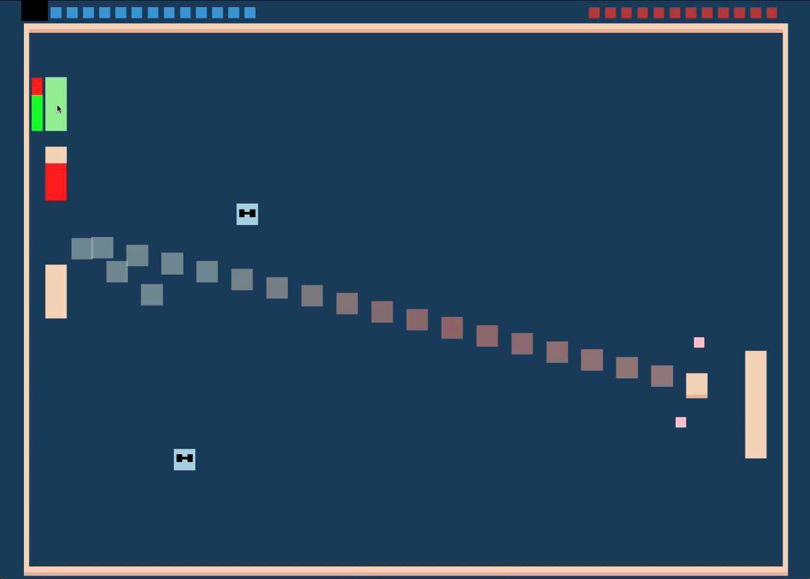

# Mult

Author: Aria Zhang

Design: Control up to three paddles and try to beat your AI foe. Watch out though, each paddle can only be used for a short period of time before they are on cooldown, so move the paddles strategically and take advantage of power ups to secure your victory.

Screen Shot:

How To Play:

Left click - select the paddle you want to move (then use the motion of the mouse to move the paddle up and down)

Space - deselect the paddle you have selected

f - use the power up in your inventory

Power ups:

Projection - reveals the trajectory of the ball

Spray - shoot out two smaller balls that disappear on impact

Freeze - freeze the AI paddle

Shrink - shrink the AI paddle

This game was built with [NEST](NEST.md).
